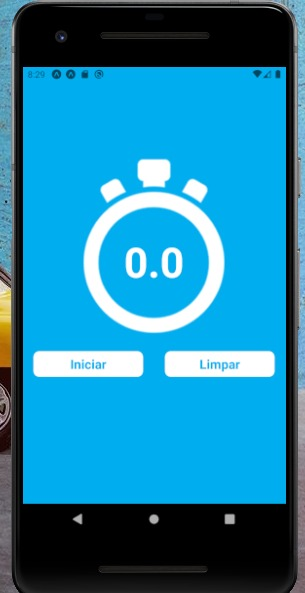
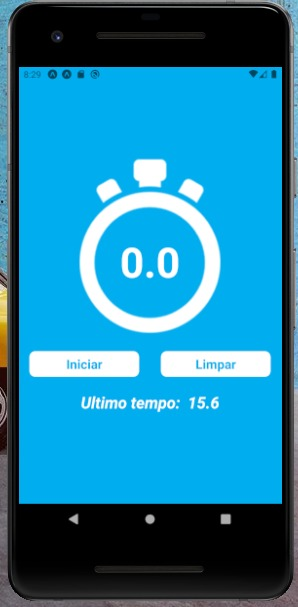

# Cronômetro

## 📃 Sobre
    O cronômetro funciona ao apertar o botão de iniciar, ao início da atividade. Por exemplo, se estiver cronometrando uma corrida, apertará o botão de iniciar quando a corrida começar.Podendo pausa sua corrida, e até mesmo limpar o tempo para reiniciar novamente
  -------------------------------------------------------------------------------------------------

--------------------------------------------------

### ⛏️ Tecnologias Utilizadas
* React-Native
* Expo
* StyleSheet
